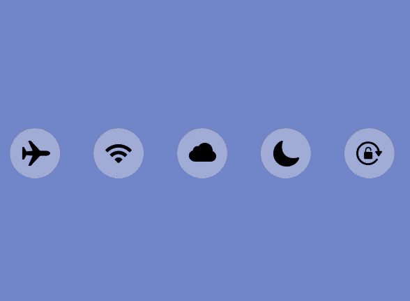

# CCButton

`CCButton` is a cool little `UIControl` subclass that mimics the looks and behaviour of the delightful iOS 8-10 era Control Center's buttons. It's easy to customize, both via code as well as Storyboards.

## Installation
### Swift Package Manager
`CCButton` is available via SPM, to install it paste this repo's address into Xcode:
```
https://github.com/wiencheck/BoldButton
```

## Usage
Use the `tintColor` property to change color of the button while in selected state. Changing tint doesn't have any effect unless the button is selected.
Use the `pressHandler` property to add your action to the `.touchUpInside` event without using the target-action pattern. As CCButton subclasses `UIControl` you can always use the `.addTarget...` or the new `.addAction...` method starting with iOS 14.
